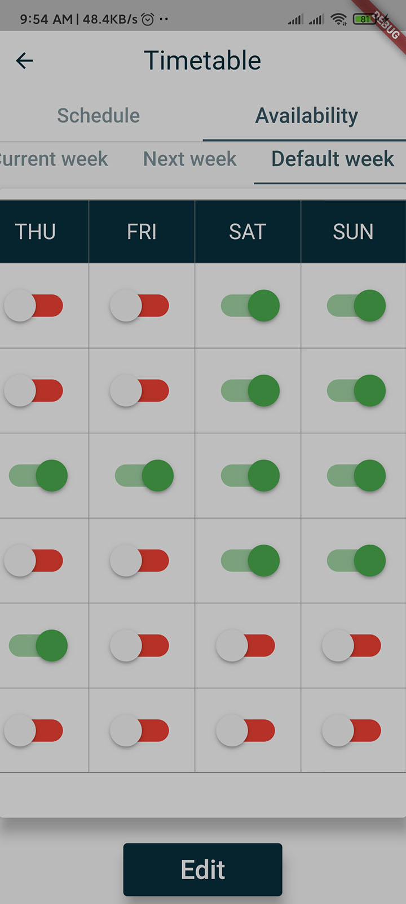

# schoolmanager

A School management System built with Flutter Google UI Framework.
This application manages the attendance, schedule, events and much more activities and task of a college/university.

## Runnning the application
This application can be tested locally by:
- Running the server locally
- Run the SMS app on your mobile phone or android virtual device
- Get connected to the network
- Input the host or ip and port on the host page [ entry page ]

### Software needed:
- Dart SDK  -> https://www.dart.com
- Flutter SDK -> https://loc
- Node -> https://loc
- VScode or Android Studio

## Interfaces
The SMS app has two main actors, having seperate interfaces

### Lecturer

#### HOME PAGE
|||
#### SCHEDULE TIMETABLE
|||
#### AVAILABILITY
||{:height="200px" width="90px"}|

## Adding Student Interface Soon

This project is a starting point for a Flutter application.

A few resources to get you started if this is your first Flutter project:

- [Lab: Write your first Flutter app](https://flutter.dev/docs/get-started/codelab)
- [Cookbook: Useful Flutter samples](https://flutter.dev/docs/cookbook)

For help getting started with Flutter, view our
[online documentation](https://flutter.dev/docs), which offers tutorials,
samples, guidance on mobile development, and a full API reference.
